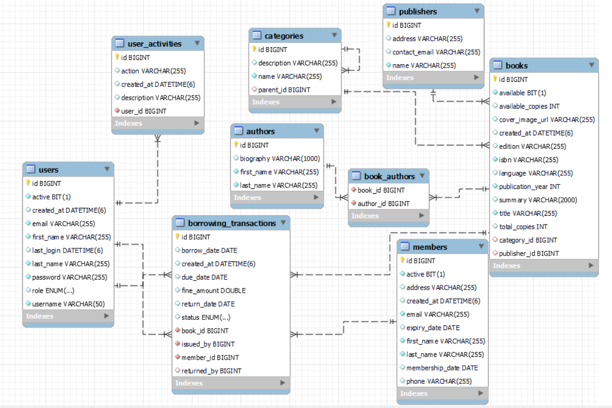

# 📚 Library Management System

A comprehensive, enterprise-grade library management system built with Spring Boot, featuring role-based access control, transaction management, and complete CRUD operations for books, members, and borrowing activities.

## 🌟 Features

### 📖 **Book Management**
- Complete book catalog with authors, publishers, and categories
- Advanced search functionality (title, author, ISBN, publication year)
- Copy management and availability tracking
- Hierarchical category system

### 👥 **Member Management** 
- Member registration and profile management
- Membership renewal and status tracking
- Advanced member search capabilities

### 🔄 **Borrowing System**
- Book checkout and return processing
- Automatic fine calculation for overdue books
- Borrowing limit enforcement (max 5 books per member)
- Book renewal functionality
- Overdue detection with automated status updates

### 🔐 **Security & User Management**
- Role-based access control (Admin, Librarian, Staff)
- Secure authentication with BCrypt password encoding
- Comprehensive activity logging
- User session management

### 📊 **Reporting & Analytics**
- Transaction history tracking
- Overdue book reports
- User activity monitoring
- Member borrowing statistics

## 🏗️ System Architecture

The application follows a clean, layered architecture:

```
📁 src/main/java/code81/Library_Management_System_Challenge/
├── 📁 application/       # Application Layer (Service Layer)
│   ├── 📁 exception/     # Custom exceptions
│   └── 📁 service/       # Business logic layer
│
├── 📁 domain/            # Domain Layer (Entities)
│   ├── 📁 model/         # Entity models
│   └── 📁 repository/    # Data access layer
│
├── 📁 infrastructure/    # Infrastructure Layer
│   ├── 📁 configuration/ # Security configuration
│   └── 📁 security/      # Authentication services
│
└── 📁 web/               # Presentation Layer (Controllers, DTOs)
    ├── 📁 controller/    # REST API endpoints
    └── 📁 dto/           # Data transfer objects
```
## 🗄️ Database Schema


The system uses a relational database with the following key entities:
- **Users**: System users with role-based permissions
- **Members**: Library members who can borrow books
- **Books**: Book catalog with metadata
- **Authors**: Book authors (many-to-many with books)
- **Publishers**: Book publishers
- **Categories**: Hierarchical book categorization
- **Borrowing Transactions**: Complete borrowing lifecycle tracking
- **User Activities**: Comprehensive audit trail


## 🚀 Getting Started

### Prerequisites
- ☕ Java 17 or higher
- 📦 Maven 3.8+
- 🗄️ MySQL 8.0+ 
- 🔧 Your favorite IDE (IntelliJ IDEA recommended)

### Installation

1. **Clone the repository**
   ```bash
   git clone https://github.com/Ahmedelsayed247/Library_Management_System_Challenge.git
   cd library-management-system
   ```

2. **Set up the database**
   ```sql
   CREATE DATABASE library_management_db;
   ```

3. **Configure application properties**
   ```properties
   # src/main/resources/application.properties
   spring.datasource.url=jdbc:mysql://localhost:3306/library_management_db
   spring.datasource.username=your_username
   spring.datasource.password=your_password
   spring.jpa.hibernate.ddl-auto=create-drop
   spring.jpa.show-sql=true
   ```

4. **Build and run**
   ```bash
   mvn clean install
   mvn spring-boot:run
   ```

5. **Load sample data** (Optional)
   ```bash
   # Execute the provided SQL scripts
   mysql -u username -p library_management_db < sql-scripts/schema.sql
   mysql -u username -p library_management_db < sql-scripts/sample-data.sql
   ```
## 🔑 Default Users

| Username | Password | Role | Permissions |
|----------|----------|------|-------------|
| `admin` | `password123` | ADMINISTRATOR | Full system access |
| `librarian1` | `password123` | LIBRARIAN | Book & member management |
| `staff1` | `password123` | STAFF | Basic operations |

## 📡 API Documentation

### Authentication
```http
POST /api/auth/login
GET  /api/auth/me
```

### Book Management
```http
GET    /api/books                    # Get all books
GET    /api/books/{id}               # Get book by ID
GET    /api/books/search?title=...   # Search books
GET    /api/books/available          # Get available books
POST   /api/books                    # Create book (Librarian+)
PUT    /api/books/{id}               # Update book (Librarian+)
DELETE /api/books/{id}               # Delete book (Admin only)
```

### Member Management
```http
GET    /api/members                  # Get all members
GET    /api/members/{id}             # Get member by ID
GET    /api/members/search?name=...  # Search members
POST   /api/members                  # Create member (Librarian+)
PUT    /api/members/{id}             # Update member (Librarian+)
PUT    /api/members/{id}/renew       # Renew membership
DELETE /api/members/{id}             # Delete member (Admin only)
```

### Borrowing Transactions
```http
GET    /api/transactions             # Get all transactions
GET    /api/transactions/overdue     # Get overdue transactions
POST   /api/transactions/borrow      # Borrow book
PUT    /api/transactions/{id}/return # Return book
PUT    /api/transactions/{id}/renew  # Renew book
```

### User Management (Admin Only)
```http
GET    /api/users                    # Get all users
POST   /api/users                    # Create user
PUT    /api/users/{id}               # Update user
DELETE /api/users/{id}               # Delete user
GET    /api/users/activity           # Get activity logs
```

## 🧪 Testing

The project includes a comprehensive Postman collection for API testing:

1. Import `postman-collection.json` into Postman
2. Set the base URL variable: `http://localhost:8080`
3. Run the collection to test all endpoints

### Test Categories
- ✅ Authentication tests
- ✅ User management tests
- ✅ Book management tests
- ✅ Member management tests
- ✅ Borrowing transaction tests
- ✅ Error handling tests
- ✅ Security authorization tests

## 🔒 Security Features

- **Authentication**: HTTP Basic Authentication
- **Authorization**: Role-based access control
- **Password Security**: BCrypt encryption
- **Activity Logging**: Comprehensive audit trail
- **Input Validation**: Bean validation with custom constraints

## 📈 Business Rules

### Borrowing Rules
- Maximum 5 books per member
- 14-day default borrowing period
- No borrowing with overdue books
- Automatic fine calculation:
  - Normal period: $1.00/day
  - Overdue period: $2.00/day

### Member Rules
- Unique email addresses
- 1-year default membership
- Active status required for borrowing

### Book Rules
- Unique ISBN validation
- Copy tracking and availability management
- Hierarchical categorization

## 🛠️ Technologies Used

- **Backend**: Spring Boot 3.x, Spring Security, Spring Data JPA
- **Database**: MySQL/PostgreSQL with Hibernate ORM
- **Build Tool**: Maven
- **Testing**: Postman
- **Security**: BCrypt, Role-based access control

**Made with ❤️ for code81**

